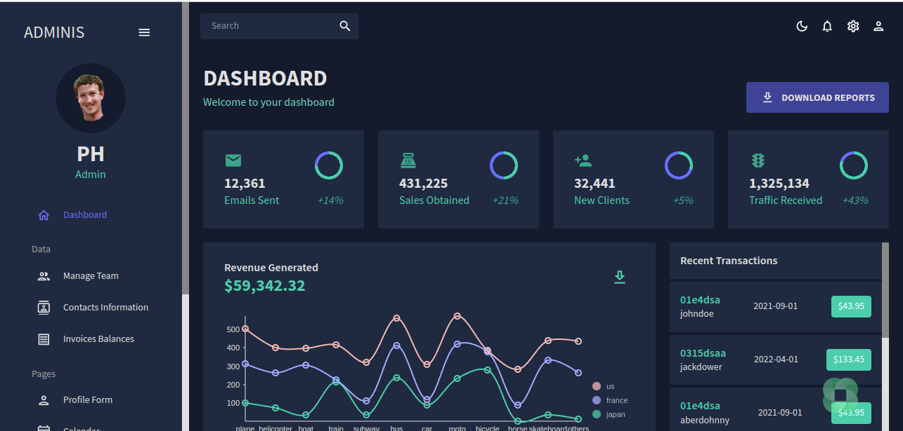
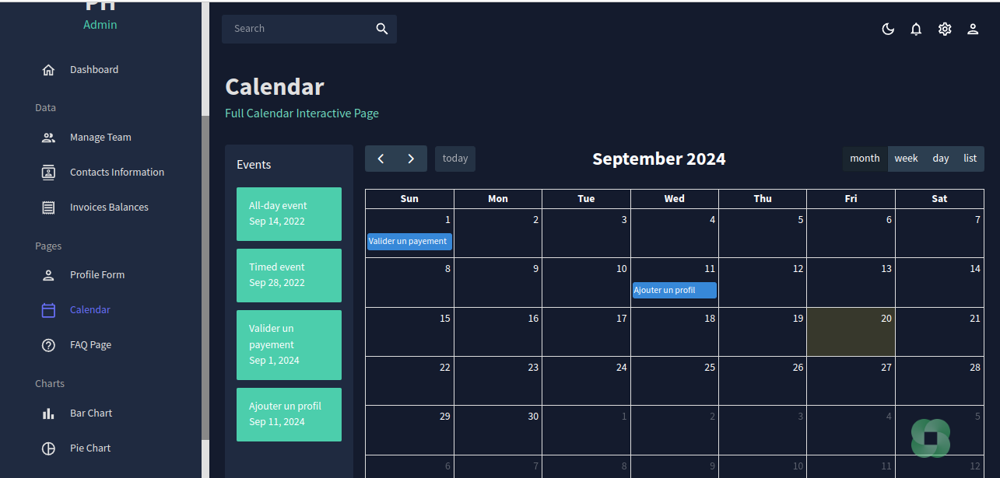
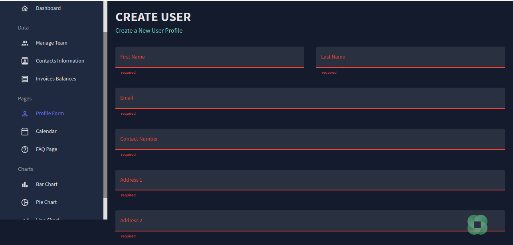

# React Admin Dashboard




## Description
Ce projet est un tableau de bord administrateur construit avec **React**, utilisant **Material UI** pour la conception d'interface, **FullCalendar** pour afficher des calendriers interactifs, et **Nivo** pour des graphiques de visualisation de données. Le projet inclut également un mode clair et un mode sombre, ainsi que des fonctionnalités de grille de données pour afficher des informations sous forme de tableau.

### Technologies utilisées

- **React:** Frontend framework

- **Material UI:** Conception d'interface utilisateur basée sur Material Design

- **React Router Dom:** Gestion des routes

- **Formik + Yup:** Gestion des formulaires et validation

- **FullCalendar:** Calendrier interactif

- **Nivo:** Visualisation de données

- **Emotion:** Styled components pour personnaliser l'apparence

## Table des matières

- **Installation**
- **Usage**
- **Fonctionnalités**
- **Pages**
- **Dépendances**
- **Licence**

## Installation

1. Clonez ce dépôt :

bash
```
git clone https://github.com/Lyrecoph/Admin_Dashboard.git
```

2. Allez dans le répertoire du projet :

bash
```
cd votre-projet
```

3. Installez les dépendances :

bash
```
npm install
```

4. Lancez l'application :

bash
```
npm start
```

5. Accédez à l'application dans le navigateur à l'adresse : `http://localhost:5000.`

## Usage

Ce tableau de bord inclut plusieurs pages pour afficher des données, des calendriers interactifs et des graphiques. Il supporte les thèmes clair et sombre, et propose des composants réactifs adaptés aux mobiles.

### Commandes importantes

- npm start : Démarre le serveur de développement.

## Fonctionnalités

- **Mode sombre/clair :** Toggle entre un thème sombre et clair.

- **Grille de données :** Affichage de tableaux interactifs avec pagination, filtres, et tri.

- **Graphiques Nivo :** Diagrammes à barres, camemberts, et plus pour visualiser des données.

- **Calendrier interactif :** Ajout, modification, et suppression d'événements directement sur le calendrier.

- **Formulaires :** Création de profils utilisateurs avec validation via Formik et Yup.

- **Téléchargement de rapports :** Un bouton de téléchargement rapide pour extraire des rapports depuis le tableau de bord.

## Pages

1. **Dashboard :** Vue d'ensemble des données principales avec des graphiques.

2. **Contacts :** Liste de contacts avec des données affichées sous forme de tableau.

3. **Calendrier :** Affichage d'un calendrier interactif.

4. **Formulaire utilisateur :** Créez de nouveaux utilisateurs via un formulaire avec validation.

5. **Graphiques :**

    - **Diagramme à barres :** Visualisation simple des données.

    - **Graphique en camembert :** Distribution des données par catégories.

    - **Graphique géographique :** Affichage de données basées sur des régions géographiques.


## Dépendances

Liste des principales bibliothèques utilisées dans ce projet :

- **@mui/material :** Composants de Material UI.

- **@mui/icons-material :** Icônes Material.

- **@mui/x-data-grid :** Grille de données de Material UI.

- **react-router-dom :** Pour la gestion des routes.

- **formik :** Gestionnaire de formulaire pour React.

- **yup :** Bibliothèque de validation.

- **@fullcalendar/react :** Composant de calendrier pour React.

- **@nivo/pie, @nivo/bar, @nivo/geo :** Composants de graphiques de Nivo.

Installez toutes les dépendances avec la commande :

bash
```
npm i @mui/material @emotion/react @emotion/styled @mui/x-data-grid @mui/icons-material react-router-dom@6 react-pro-sidebar formik yup @fullcalendar/core @fullcalendar/daygrid @fullcalendar/timegrid @fullcalendar/list @nivo/pie @nivo/line @nivo/bar @nivo/geo
```

## Licence
Ce projet est sous licence MIT.

